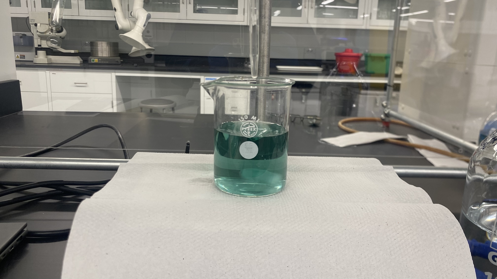
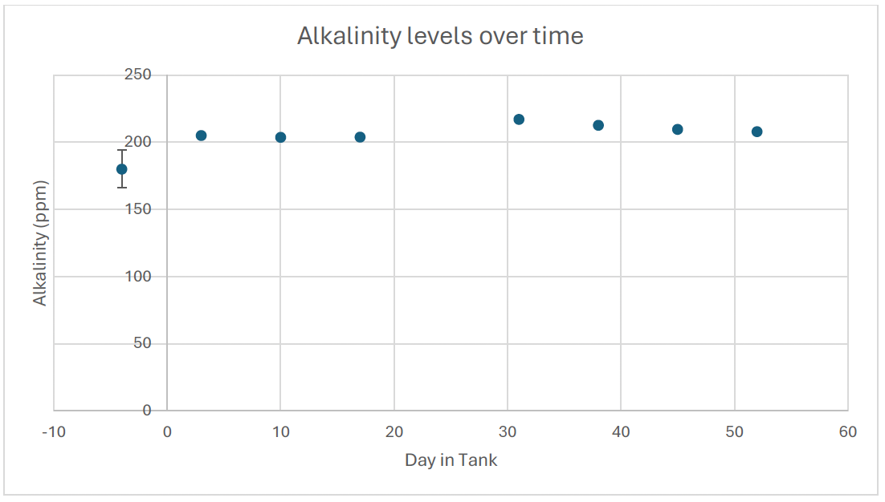

:::{.custom-grid-2col}

<!-- ROW 1: BOTH TEXT SECTIONS -->
:::{.grid-text-cell}
### Experiment Overview

In this experiment, I use a combination of pH titration with indicators and spectrophotometric determination of overall pH to analyze the concentration of carbonate and bicarbonate in a sample of seawater from a controlled fish habitat. To measure the alkalinity of the solution, I decided to titrate the unknown alkalinity of seawater against a known concentration of hydrochloric acid solution. Since the ions that affect alkalinity are all basic, titrating with a known concentration of a strong acid will give me the amount of hydronium ions that are needed to neutralize the solution. Then, using the Henderson Hasselbach equation, I can determine the overall pH of the solution, given a measurement of concentration of either form of an indicator dye.

:::

:::{.grid-text-cell}
### Results

The results of this experiment that alkalinity levels within the fish tank remain relatively stable. The largest change in alkalinity is reflected by an equally large increase in calcium ions, since calcium carbonate exists in equilibrium between the solid state and dissolved state. However, since alkalinity represents the buffering capacity of the seawater, and the pH of the seawater remained similar, there were no harmful results. These conclusions were drawn using a combination of experimental methods and statistical tests performed in R programming language. 

  [Final Report](files/Qiu_FinalReport_Alkalinity.pdf){.custom-btn .btn-grey}

:::

<!-- ROW 2: BOTH IMAGES & CAPTIONS -->
:::{.grid-image-cell}

:::{.col-caption}
A titrated solution of seawater using bromocresol green as a pH indicator (equivalence point around 3.8 - 5.4 pH). 
:::
:::

:::{.grid-image-cell}

:::{.col-caption}
The fish tank's alkalinity levels plotted over time. These values were obtained using my experimental method!
:::
:::

:::