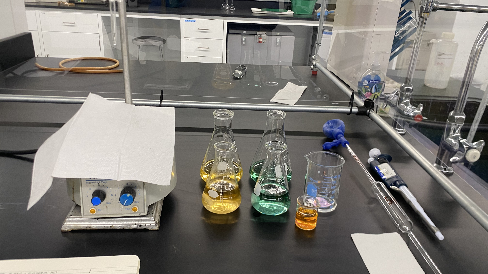
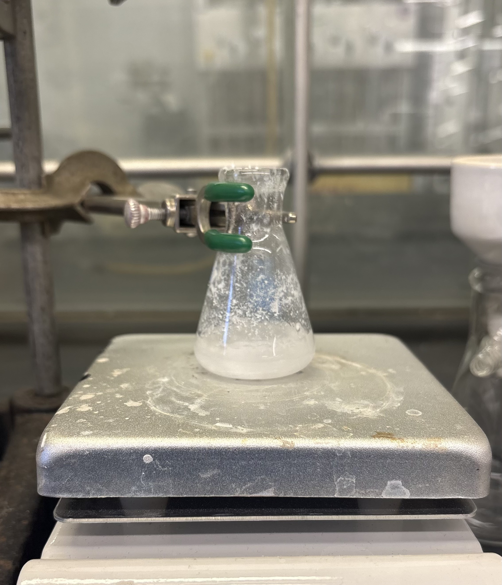

:::: {.project-card .border .rounded .p-0 .mb-4 .shadow-sm style="display: flex; flex-direction: row; align-items: center; overflow: hidden; position: relative;"}

::: {style="flex: 0 0 30%; max-width: 30%; height: 220px;"}
{style="width: 100%; height: 100%; object-fit: cover; display: block;"}
:::

::: {style="flex: 0 0 70%; max-width: 70%; padding: 1.5rem;"}
### [Analysis of Alkalinity of Seawater Using Titration and UV Spectroscopy](chemical_analysis/more.qmd){.stretched-link .text-decoration-none .text-dark}

This report proposes a method of measuring alkalinity in seawater using titration and UV spectroscopy techniques. The goal of this report was to develop a unique procedure to quantify alkalinity levels in a laboratory saltwater tank.

`Titration` `UV Spectroscopy` 
:::

::::

<!-- NEXT -->

:::: {.project-card .border .rounded .p-0 .mb-4 .shadow-sm style="display: flex; flex-direction: row; align-items: center; overflow: hidden; position: relative;"}

::: {style="flex: 0 0 30%; max-width: 30%; height: 220px;"}
{style="width: 100%; height: 100%; object-fit: cover; display: block;"}
:::

::: {style="flex: 0 0 70%; max-width: 70%; padding: 1.5rem;"}
### [Synthesis of 4,4,4-Trifluoro-1-(4-methyl-phenyl)-butane-1,3-dione through a Claisen Condensation Mechanism](organic_chemistry/more.qmd){.stretched-link .text-decoration-none .text-dark}

This report details a proposed greener synthesis method for 4,4,4-trifluoro-1-(4-methyl-phenyl)-butane-1,3-dione, which is an important precursor in the synthesis of the popular non-steroidal drug Celecoxib. This synthesis mechanism is attempted within an undergraduate laboratory setting, and further modifications are proposed to improve synthesis success rates. 

`H NMR` `C NMR` `IR Spectroscopy` `Rotary Evaporator`  
:::

::::

