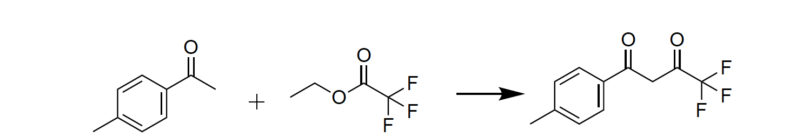
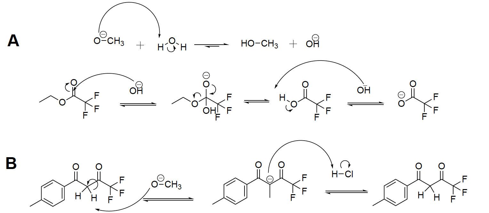

:::{.custom-grid-2col}

<!-- ROW 1: BOTH TEXT SECTIONS -->
:::{.grid-text-cell}
### Experiment Overview

4,4,4-trifluoro-1-(4-methyl-phenyl)-butane-1,3-dione is an important precursor in the synthesis of the popular non-steroidal drug Celecoxib. Traditional synthesis of this compound typically involves large quantities of toxic solvents and high amounts of heating, resulting in a not very green synthesis mechanism.1 A novel synthesis of 4,4,4-trifluoro-1-(4-methyl-phenyl)-butane-1,3-dione was proposed by Francis Ho, James Sherwod, and Glenn A. Hurst in their paper “A Greener Syn-thesis of the Nonsteroidal Anti-inflammatory Drug Celecoxib” using a room temperature environment and minimal toxic reagents.2 This synthesis mechanism is attempted to be replicated in an undergraduate laboratory setting, and modifications are proposed to improve synthesis success rates.

:::

:::{.grid-text-cell}
### Results

Of the three reaction mechanism attempted, none of the H-NMRs yielded a critical 5.96ppm peak that characterized the desired product. As a result, it was concluded that the product was not synthesized in any of the reactions. Possible confounding factors could vary widely. First, one of the most critical reagents in the reaction is the basic properties of the sodium methoxide reagent. A dry environment was incorporated in the second and third reaction mechanisms in order to protect the reaction from side reactions. However, the sodium methoxide reactant was not tested individually. It is possible that it was contaminated, and therefore unable to act as a base in all three reactions. Second, further investigation into the “driving” deprotonation step of the Claisen Condensation could also be a source of error in the synthesis mechanism. Literature research suggests that a stronger base was likely needed to push the reaction forward. 

  [Final Report](files/Independent_Synthesis_Report.pdf){.custom-btn .btn-grey}

:::

<!-- ROW 2: BOTH IMAGES & CAPTIONS -->
:::{.grid-image-cell}

:::{.col-caption}
The proposed synthesis mechanism for 4,4,4-Trifluoro-1-(4-methyl-phenyl)-butane-1,3-dione through a Claisen Condensation Reaction. 
:::
:::

:::{.grid-image-cell}

:::{.col-caption}
Possible sources of synthesis error from side reactions. A shows a side reaction between sodium methoxide and water, while B shows an irreversible step in the Claisen Condensation that neutralizes the nucleophile.
:::
:::

:::