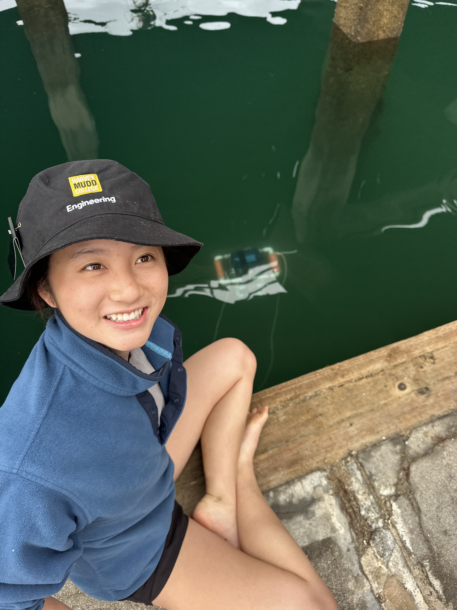

:::{.custom-grid}

<!-- ROW 1: ALL 3 TEXT SECTIONS -->
:::{.grid-text-cell}
### Objective

The goal of this project was to design an autonomous underwater vehicle that can dive to up to 2 meters of depth and quantify water pollution measure water temperature, turbidity, and pressure. This project was constrained by a 6 week time period to ideate, prototype, build, iterate, and then deploy. The team was given a $50 dollar budget, and had 6 weeks to complete the robot.
:::

:::{.grid-text-cell}
### Process

The build process involved using PVC pipes and connectors to build the mechanical frame of the robot. The motors were mounted and secured using 3D printed motor mounts and zipties. A waterproof electronics box with epoxy-sealed pass-throughs enabled external components to be connected to the motherboard inside the box. During the electronic iteration process, all circuits were built on breadboards and tested using oscilliscopes to verify correct input and output signals before mounting them onto the final protoboard. 
:::

:::{.grid-text-cell}
### Results

The final robot was deployed off the dock at Dana Point Baby Beach. The collected values were compared with ground truth values to ensure accuracy in data collection. From this data, the team was able to draw the conclusion that there is indeed some level of non-negligible human pollution at Dana Point, based on the discrepancies between the expected "healthy" values of pH, temperature, and turbidity of ocean water.

  [Final Report](files/ENGR080_Final_Report.pdf){.custom-btn .btn-grey}
  [Final Poster](files/Team_27_Poster.pdf){.custom-btn .btn-grey}

:::

<!-- ROW 2: ALL 3 IMAGES & CAPTIONS -->
:::{.grid-image-cell}

:::{.col-caption}
Breadboarding allowed us to plan before all the parts were soldered onto the protoboard to maximize our budget.
:::
:::

:::{.grid-image-cell}

:::{.col-caption}
As part of our process, we also performed a lot of waterproof testing in the laboratory tank to ensure that all the electronics were properly waterproofed.
:::
:::

:::{.grid-image-cell}

:::{.col-caption}
Dana Point deployment at the dock of Baby Beach!
:::
:::

:::

