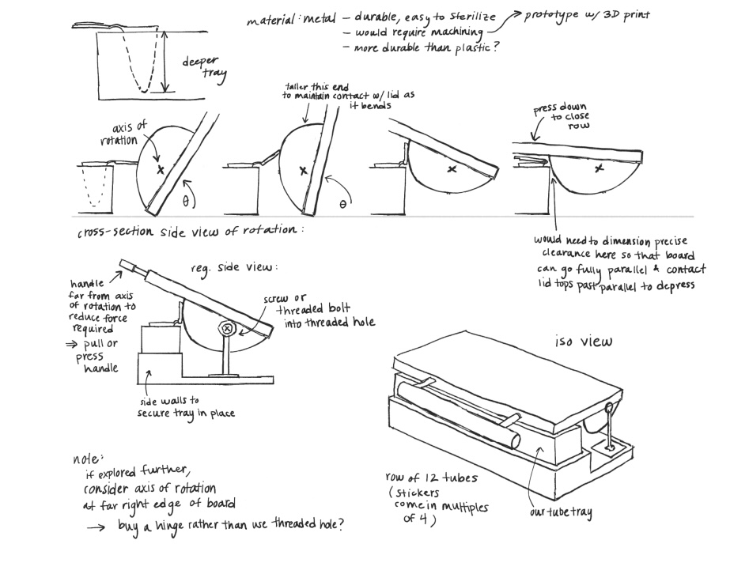
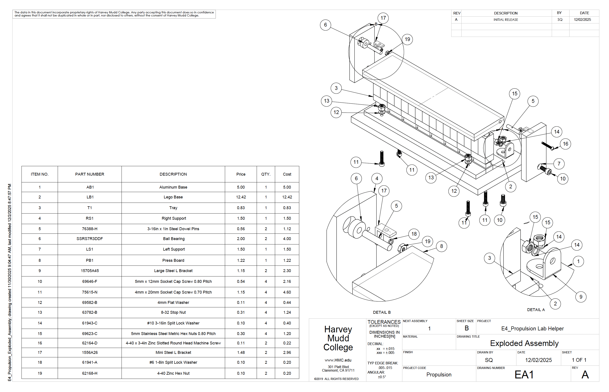
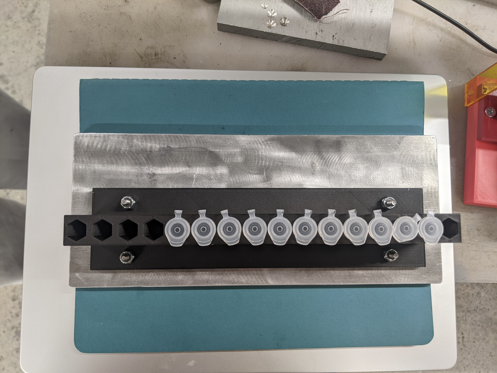

:::{.custom-grid}

<!-- ROW 1: ALL 3 TEXT SECTIONS -->
:::{.grid-text-cell}
### Objective

The goal of this project was to design an engineering solution guided by a client proposed problem. Our client was a lab technician at the college who was experiencing a significant amount of hand strain from closing hundreds of microfuge tubes by hand every day. The team was given a $100 dollar budget and had 6 weeks to complete the project. 
:::

:::{.grid-text-cell}
### Process

This design process started with listing project objectives, constraints, and functions. Each design idea was evaluated using a set of quantitative and qualitative metrics, and the final solution was chosen based on whichever solution scored the highest. The parts were then fabricated within the college's machine shop and makerspace. All 3D printed parts were made out of nylon carbon fiber filament to ensure that lab chemicals did not denature it over time, and metal parts were machined out of aluminum on a mill. 
:::

:::{.grid-text-cell}
### Results

The final solution allowed the client to close tubes over 4.7 times faster than her original method. In addition, she indicated a noticeably lower level of hand strain at the end of the day. This project provided an excellent introduction to design and manufacturing, as well as good practice in balancing client objectives with engineering constraints! 

  [Final Report](files/Final_Prototype_Memo_Propulsion.pdf){.custom-btn .btn-grey}
  [Drawings, BOM, and Process Router](files/E4_Propulsion_Drawings_BOM_ProcessRouters.pdf){.custom-btn .btn-grey}

:::

<!-- ROW 2: ALL 3 IMAGES & CAPTIONS -->
:::{.grid-image-cell}

:::{.col-caption}
During the planning stage, each design idea was fully sketched and evaluated to ensure that all client requests were being satisfied by the design. 
:::
:::

:::{.grid-image-cell}

:::{.col-caption}
A large part of my responsibility on this team was to design the entire assembly in CAD to ensure that there were no conflicting parts and everything was dimensioned correctly!
:::
:::

:::{.grid-image-cell}

:::{.col-caption}
A part of our final design included a removable lego base for the microfuge tray! This allowed the client to quickly insert and remove tubes from the device without being hindered by the closing mechanism. 
:::
:::

:::

