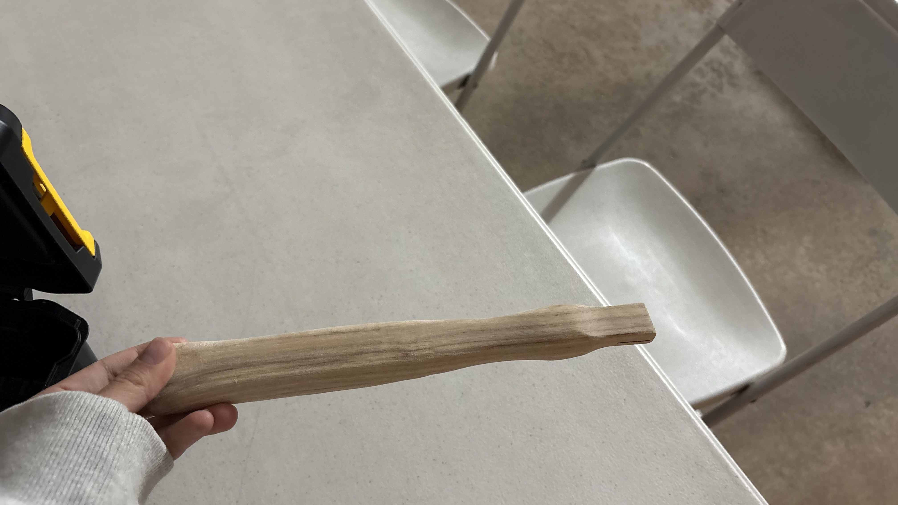
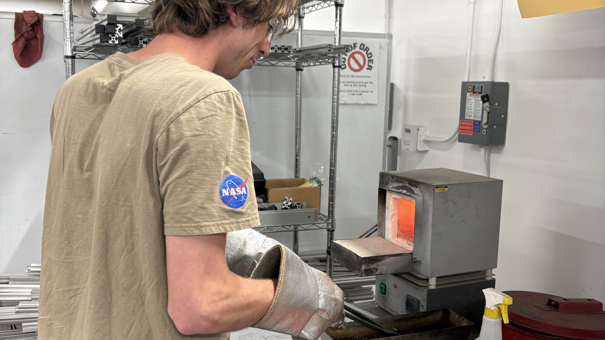

:::{.custom-grid}

<!-- ROW 1: ALL 3 TEXT SECTIONS -->
:::{.grid-text-cell}
### Objective

The objective of this project was to practice reading an engineering drawing and then building a part to the specifications indicated in the drawing. 
:::

:::{.grid-text-cell}
### Process

All parts were manufactured in the college's machine shop. The tools used to build each part included the following: laser cutter, bandsaw, lathe, mill, oven, and HRC hardness testing device. 
:::

:::{.grid-text-cell}
### Results

The end of this project yielded a fully functional machinist hammer!

  [Technical Drawings](files/E4_hammer_tech_drawing.pdf){.custom-btn .btn-grey}

:::

<!-- ROW 2: ALL 3 IMAGES & CAPTIONS -->
:::{.grid-image-cell}

:::{.col-caption}
First stage: cutting the handle to shape and then hand-sanding it to match the specifications.  
:::
:::

:::{.grid-image-cell}

:::{.col-caption}
I worked with a teammate to take turns watching the oven during the annealing and hardening process!
:::
:::

:::{.grid-image-cell}

:::{.col-caption}
Final hammer!
:::
:::

:::

