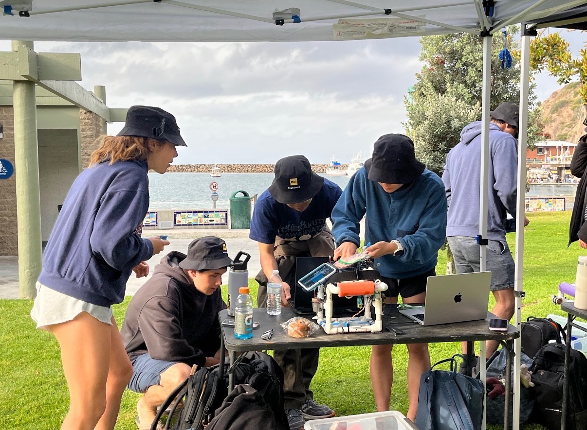
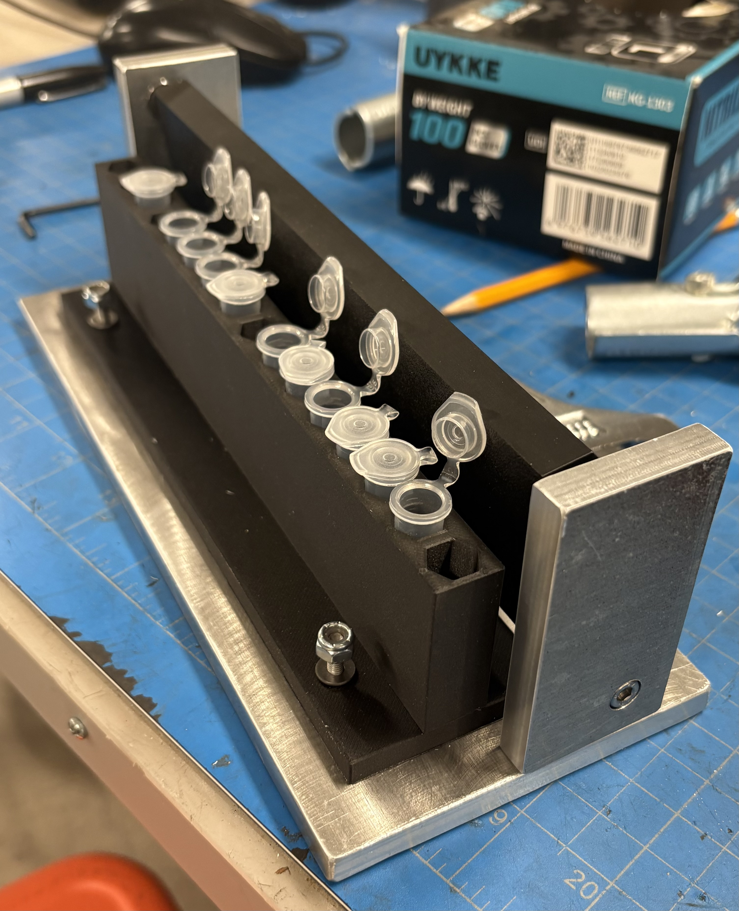

:::: {.project-card .border .rounded .p-0 .mb-4 .shadow-sm style="display: flex; flex-direction: row; align-items: center; overflow: hidden; position: relative;"}

::: {style="flex: 0 0 30%; max-width: 30%; height: 220px;"}
{style="width: 100%; height: 100%; object-fit: cover; display: block;"}
:::

::: {style="flex: 0 0 70%; max-width: 70%; padding: 1.5rem;"}
### [Autonomous Underwater Vehicle (AUV)](AUV/more.qmd){.stretched-link .text-decoration-none .text-dark}

A 6-week project to design and build an autonomous water vehicle that measures water pollution using a pH sensor, turbidity sensor, linear temperature sensor, and pressure sensor. This robot was deployed at Dana Point Beach with 2.5 minutes of autonomous driving. 

`Arduino` `MATLAB` `3D-Printing`
:::

::::

<!-- NEXT -->

:::: {.project-card .border .rounded .p-0 .mb-4 .shadow-sm style="display: flex; flex-direction: row; align-items: center; overflow: hidden; position: relative;"}

::: {style="flex: 0 0 30%; max-width: 30%; height: 220px;"}
{style="width: 100%; height: 100%; object-fit: cover; display: block;"}
:::

::: {style="flex: 0 0 70%; max-width: 70%; padding: 1.5rem;"}
### [1.7mL Microfuge Tube Closing Mechanism](E4/more.qmd){.stretched-link .text-decoration-none .text-dark}

A 6-week project that focused on using engineering design and manufacturing to solve a client proposed problem. The client required a solution that closed a high volume of 1.7mL microfuge tubes quickly with minimal hand strain. 

`Rapid Prototyping` `Mill` `Solidworks CAD`
:::

::::

<!-- NEXT -->

:::: {.project-card .border .rounded .p-0 .mb-4 .shadow-sm style="display: flex; flex-direction: row; align-items: center; overflow: hidden; position: relative;"}

::: {style="flex: 0 0 30%; max-width: 30%; height: 220px;"}
{style="width: 100%; height: 100%; object-fit: cover; display: block;"}
:::

::: {style="flex: 0 0 70%; max-width: 70%; padding: 1.5rem;"}
### [Hammer](Hammer/more.qmd){.stretched-link .text-decoration-none .text-dark}

A machinist hammer manufactured out of AISI 1015 & 4340 steel, oak wood, and nylon. This project was completed following strict drawing specifications with up to 0.001" precision. 

`Lathe` `Mill` `Bandsaw` `Laser Cutter` `HRC Hardness Tester` `GD&T`
:::

::::