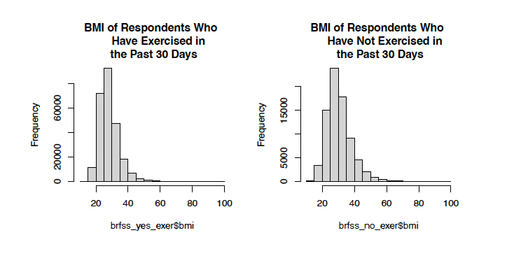
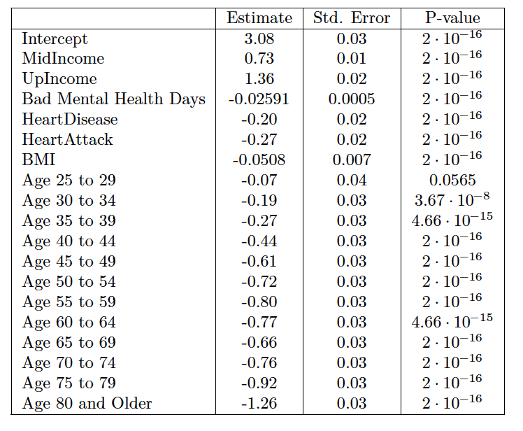

:::{.custom-grid-2col}

<!-- ROW 1: BOTH TEXT SECTIONS -->
:::{.grid-text-cell}
### Objective

The United States Centers for Disease Control and Prevention conducted an annual telephone survey to
gather information about U.S. residents’ health related conditions and risk behaviors. In this report,
we focus on the 2022 survey data. More specifically, we are interested in analyzing the variable *anyexer* and its association with the variables in the data set about mental health, heart disease/heart attack diagnoses, smoking status, BMI, and income. During each analysis, we explained possible confounding variables that we believe
could have an effect on the data that are not reflected or addressed in the test results. Then, based on
the associations we found, we determined which variables significantly contributed to the likelihood of a
positive exercise status for an individual, and then fitted a logistic model to the *anyexer* variable based
on the other variables mentioned above.

:::

:::{.grid-text-cell}
### Results

This project allowed me to explore various statistical tests in the R programming language. I gained experience determining when to run which statistical analysis, including: difference of two proportion tests, comparison of many proportions, difference of two means t-test, and logistic modeling. I also checked the assumptions for each test to ensure that the dataset was suitable for each analysis. 

  [Final Report](files/Final_Project.pdf){.custom-btn .btn-grey}

:::

<!-- ROW 2: BOTH IMAGES & CAPTIONS -->
:::{.grid-image-cell}

:::{.col-caption}
An example of a histogram graph of BMI separated by individuals who exercise, and individuals who don't exercise. These types of histograms helped visualize the comparison of means tests performed on these two categories!
:::
:::

:::{.grid-image-cell}

:::{.col-caption}
This chart shows all of the logistic refression coefficients in the logistic model. These coefficients are generated from the health predictors that contribute to the exercise variable in the datset. 
:::
:::

:::