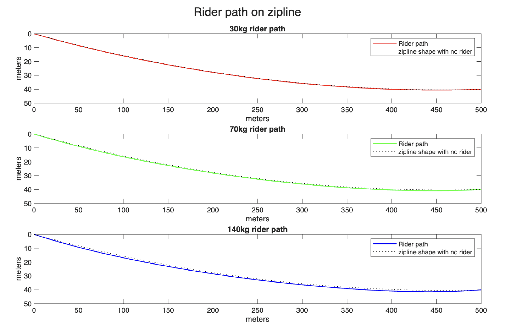
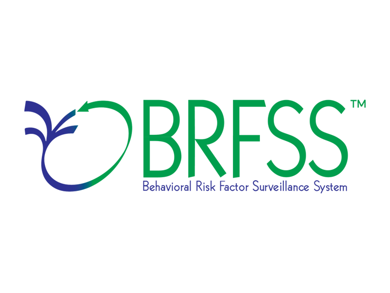

:::: {.project-card .border .rounded .p-0 .mb-4 .shadow-sm style="display: flex; flex-direction: row; align-items: center; overflow: hidden; position: relative;"}

::: {style="flex: 0 0 30%; max-width: 30%; height: 220px;"}
{style="width: 100%; height: 100%; object-fit: cover; display: block;"}
:::

::: {style="flex: 0 0 70%; max-width: 70%; padding: 1.5rem;"}
### [Zipline Optimization](zipline_optimization/more.qmd){.stretched-link .text-decoration-none .text-dark}

This report aims to evaluate the optimal set up for a zipline given a set of constraints and objectives. The optimization was done in MATLAB and involved solving for differential equations, building a piece-wise 3rd degree polynomial of the pathway, and minimizing a given function to optiimize the final solution. 

`MATLAB`
:::

::::

<!-- NEXT -->

:::: {.project-card .border .rounded .p-0 .mb-4 .shadow-sm style="display: flex; flex-direction: row; align-items: center; overflow: hidden; position: relative;"}

::: {style="flex: 0 0 30%; max-width: 30%; height: 220px;"}
{style="width: 100%; height: 100%; object-fit: cover; display: block;"}
:::

::: {style="flex: 0 0 70%; max-width: 70%; padding: 1.5rem;"}
### [Data Analysis of the 2022 CDC Behavioral Risk Factor Surveillance System (BRFSS) Survey](cdc-brfss/more.qmd){.stretched-link .text-decoration-none .text-dark}

An analysis into the 2022 CDC BRFSS survey data, specifically the relationship between survey respondents' exercise levels to other health and demographic variables. This analysis was done in R statistical programming language and involves t tests, proportion tests, comparison of many proportions, and logistic modeling. 

`R Statistical Programming Language`
:::

::::

