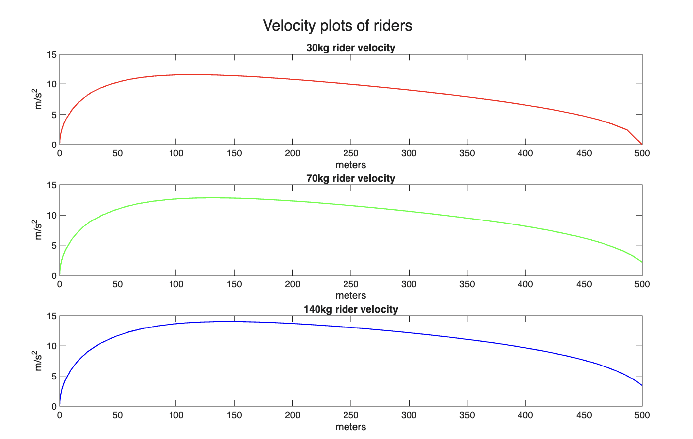

:::{.custom-grid-2col}

<!-- ROW 1: BOTH TEXT SECTIONS -->
:::{.grid-text-cell}
### Objective

This report aims to evaluate the optimal set up for a zipline given a set of constraints and objectives. The zipline is characterized by a combination of a set of physical parameters and optimized parameters. Three separate riders are evaluated on this zipline: a 30kg rider, a 70kg rider, and a 140kg rider. The objective of this problem is to optimize the zipline height drop and wire tension such that the maximum speed of the 70kg rider is maximized within a set of constraints.

:::

:::{.grid-text-cell}
### Results

Through this project, I developed skills for manipulating functions and differential equations within MATLAB to solve optimization problems subject to a certain number of constraints. The main MATLAB functions I became familiar with include *spline*, *fnder*, *ode45*, and *fmincon*. 

  [Final Report](files/ENGR072_Homework_13.pdf){.custom-btn .btn-grey}

:::

<!-- ROW 2: BOTH IMAGES & CAPTIONS -->
:::{.grid-image-cell}

:::{.col-caption}
To check my simulated ziplines, I also plotted each rider's velocity to ensure that everything passes the sanity check!
:::
:::

:::{.grid-image-cell}

:::{.col-caption}
The final plots of the different riders' paths along the zipline!
:::
:::

:::